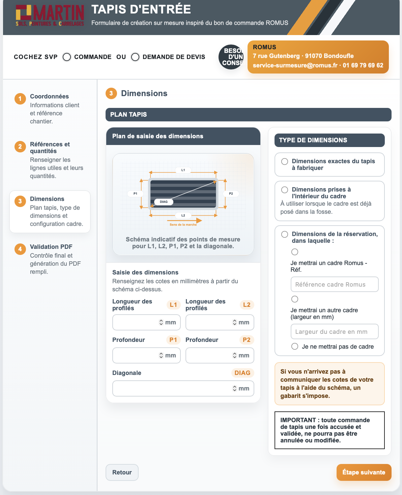
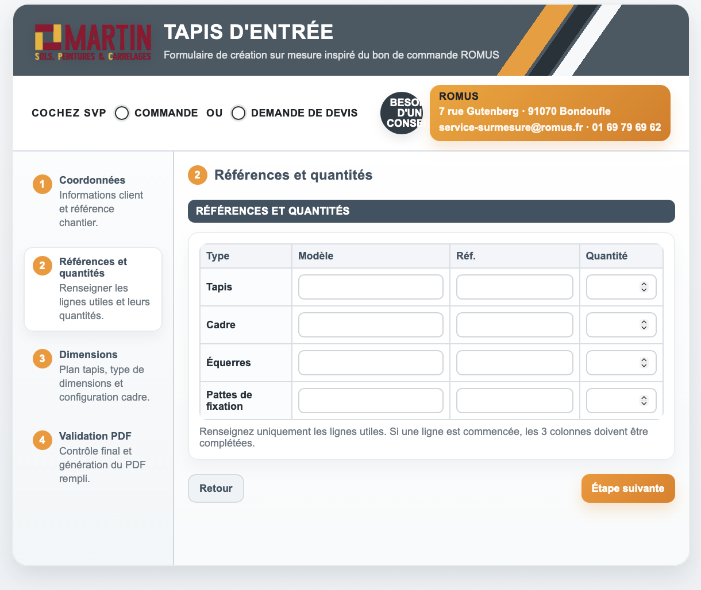

# tapis_romus

Application web statique pour saisir un bon de commande ROMUS de tapis d'entree sur mesure et generer un PDF rempli directement depuis le navigateur.

## Apercu

Le projet propose un formulaire multi-etapes avec :

- saisie des coordonnees client
- references et quantites
- saisie des dimensions
- recapitulatif avant generation
- export du PDF final

Le projet est concu en HTML, CSS et JavaScript sans build ni dependance npm.

## Fonctionnalites

- navigation par etapes avec validation visuelle
- stepper cliquable avec etat de validation
- gestion du mode commande ou demande de devis
- affichage conditionnel du numero de commande
- schema de dimensions et saisie guidee
- remplissage d'un PDF ROMUS via `pdf-lib`

## Exemples visuels

### Vue d'ensemble

### Formulaire multi-etapes

### Saisie des mesures

## Structure

- `index.html` : interface complete, styles et logique JavaScript
- `logo.png` : logo affiche dans l'en-tete, remplacable pour integrer le formulaire a un autre site
- `images/` : captures d'ecran d'exemple utilisees dans le README
- `pdf-lib.min.js` : bibliotheque utilisee pour remplir et exporter le PDF
- `BON DE COMMANDE TAPIS ROMUS_AOUT2025.pdf` : document source de reference

## Personnalisation

Le logo peut etre remplace facilement en modifiant le fichier `logo.png`.

Cela permet d'integrer ce formulaire a l'identite visuelle d'un client ou de l'adapter a leur site internet ou a un usage interne sans modifier le fonctionnement principal de l'application.

## Utilisation

1. Choisir `COMMANDE n°` ou `DEMANDE DE DEVIS`
2. Completer les informations de l'etape 1
3. Renseigner les references utiles a l'etape 2
4. Saisir les dimensions a l'etape 3
5. Verifier le recapitulatif
6. Generer le PDF rempli

## Auteur

Cree par Jean-Philippe DEGERT

GitHub : [https://github.com/jp2creation](https://github.com/jp2creation)
